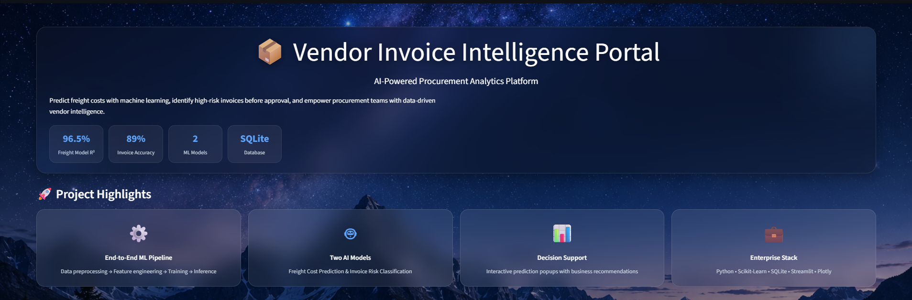
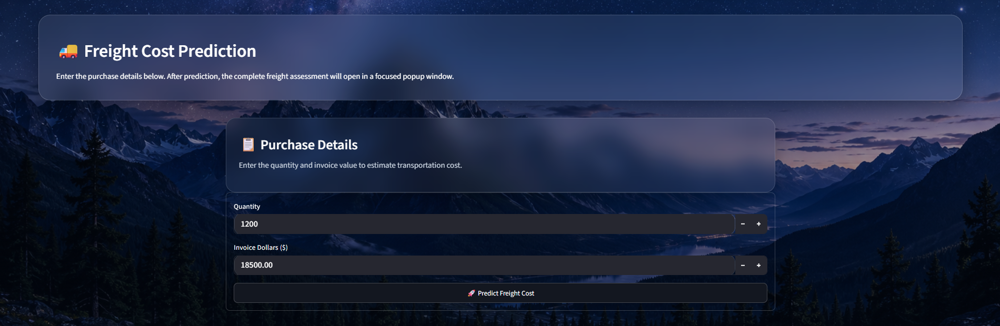
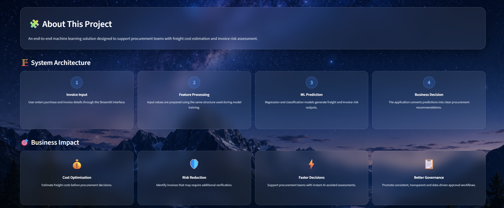
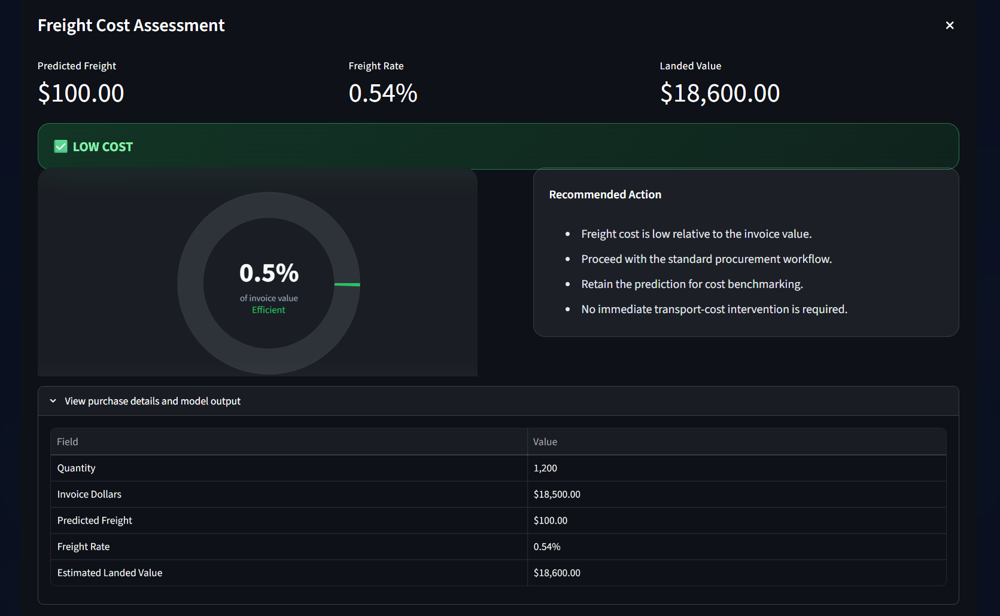
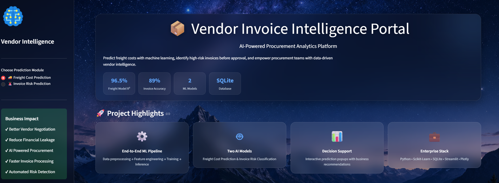
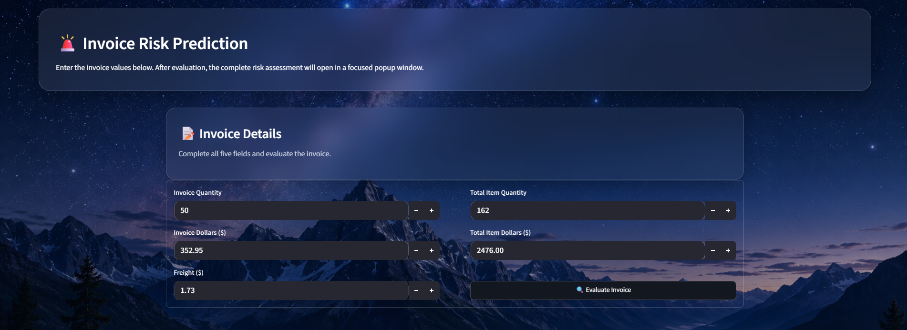
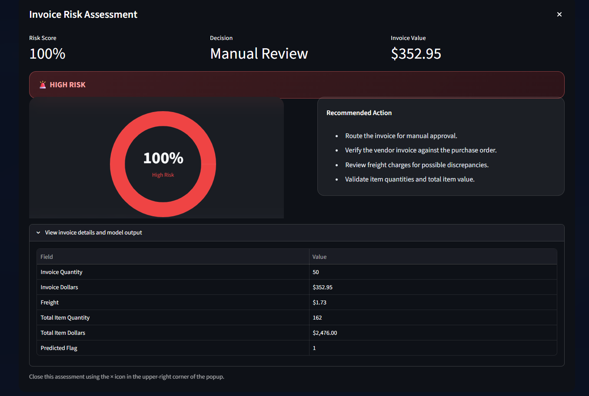
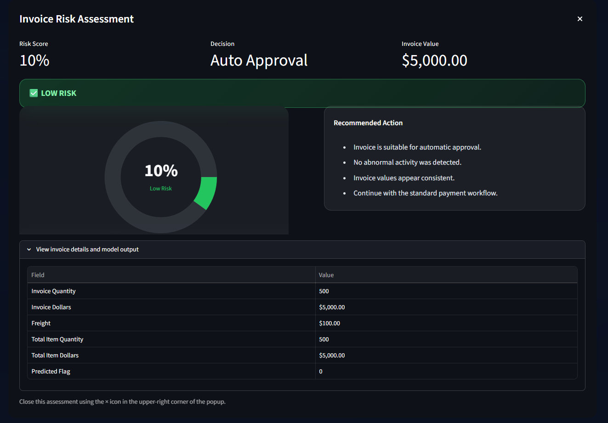

# 📦 Vendor Invoice Intelligence Portal

::: {align="center"}
# AI‑Powered Procurement Analytics Platform

An enterprise-inspired end-to-end Machine Learning solution that
empowers procurement teams with intelligent **Freight Cost Prediction**
and **Invoice Risk Assessment**.

```{=html}
<p>
```
``{=html}
``{=html}
``{=html}
``{=html}
``{=html}
```{=html}
</p>
```
:::

------------------------------------------------------------------------

## Executive Summary

Vendor Invoice Intelligence Portal is an end-to-end analytics platform
that demonstrates how machine learning can improve procurement
decision-making by predicting transportation costs and identifying
invoices that require additional review.

### Business Capabilities

-   🚚 Freight Cost Prediction
-   🚨 Invoice Risk Prediction
-   📊 Interactive Assessment Reports
-   💼 Business Recommendations
-   📈 Enterprise Dashboard

------------------------------------------------------------------------

# Business Problem

Procurement and finance teams often rely on manual invoice verification
and historical judgment when evaluating transportation costs and vendor
invoices. This leads to inconsistent approvals, operational delays, and
increased financial risk.

This platform demonstrates how predictive analytics can support faster,
more consistent, and data-driven procurement decisions.

------------------------------------------------------------------------

# Key Features

  -----------------------------------------------------------------------
  Capability                         Description
  ---------------------------------- ------------------------------------
  Freight Cost Prediction            Estimate transportation cost before
                                     procurement approval

  Invoice Risk Assessment            Identify invoices requiring manual
                                     verification

  Interactive Reports                Detailed assessment popups with
                                     recommendations

  Dashboard                          Modern Streamlit interface with
                                     business insights

  Decision Support                   Actionable recommendations generated
                                     from model predictions
  -----------------------------------------------------------------------

------------------------------------------------------------------------

# 📸 Application Showcase

## 🏠 Homepage



The landing page introduces the platform, project highlights, model
metrics, and enterprise technology stack.

------------------------------------------------------------------------

## 🚚 Freight Cost Prediction



Predict freight costs using purchase quantity and invoice value before
procurement decisions are finalized.

------------------------------------------------------------------------

## 🧩 Project Overview & Business Impact



Highlights the project objective, solution architecture, business value,
and organizational impact.

------------------------------------------------------------------------

## 🛠️ Technology Stack


The application is developed using Python, Scikit-Learn, Streamlit,
SQLite, and Plotly.

------------------------------------------------------------------------

## 📊 Freight Assessment Report



The generated assessment includes: - Predicted Freight - Freight Rate -
Landed Cost - Business Recommendation - Purchase Summary

------------------------------------------------------------------------

## 📈 Enterprise Dashboard



Switch seamlessly between Freight Cost Prediction and Invoice Risk
Prediction while viewing project highlights.

------------------------------------------------------------------------

## 🚨 Invoice Risk Prediction



Evaluate invoice attributes to determine whether an invoice should be
approved automatically or reviewed manually.

------------------------------------------------------------------------

## 🔴 High-Risk Assessment



Displays the risk score, approval decision, recommendations, and invoice
details for high-risk cases.

------------------------------------------------------------------------

## 🟢 Low-Risk Assessment



Shows invoices suitable for automatic approval along with business
recommendations.

------------------------------------------------------------------------

# Solution Architecture

``` text
             User Input
                  │
                  ▼
        Feature Engineering
                  │
      ┌───────────┴───────────┐
      ▼                       ▼
 Freight Regression     Invoice Classification
      │                       │
      └───────────┬───────────┘
                  ▼
     Business Recommendation Engine
                  ▼
 Interactive Assessment Dashboard
```

------------------------------------------------------------------------

# Machine Learning Workflow

1.  Data Collection
2.  Data Preprocessing
3.  Feature Engineering
4.  Model Training
5.  Model Evaluation
6.  Model Serialization
7.  Streamlit Deployment
8.  Real-Time Prediction

------------------------------------------------------------------------

# Technology Stack

  Layer              Technology
  ------------------ ----------------
  Language           Python
  Machine Learning   Scikit-Learn
  Frontend           Streamlit
  Database           SQLite
  Visualization      Plotly
  Data Processing    Pandas & NumPy

------------------------------------------------------------------------

# Project Structure

``` text
0_Vendor Freight Cost Prediction/
├── app.py
├── assets/
├── screenshots/
├── freight_cost_prediction/
├── invoice_flagging/
├── inference/
├── Data/
├── requirements.txt
└── README.md
```

------------------------------------------------------------------------

# Installation

``` bash
git clone https://github.com/sourabhkeshri026/Machine_Learning_Projects.git
cd "0_Vendor Freight Cost Prediction"
pip install -r requirements.txt
streamlit run app.py
```

------------------------------------------------------------------------

# Future Enhancements

-   Explainable AI (SHAP)
-   Vendor Risk Scoring
-   Prediction History
-   OCR Invoice Processing
-   AI Procurement Assistant
-   Cloud Deployment

------------------------------------------------------------------------

# Author

**Sourabh Kumar Keshri**

MBA (Data Science & AI)\
Indian Institute of Technology (IIT) Mandi

If you found this project useful, consider giving the repository a ⭐.
